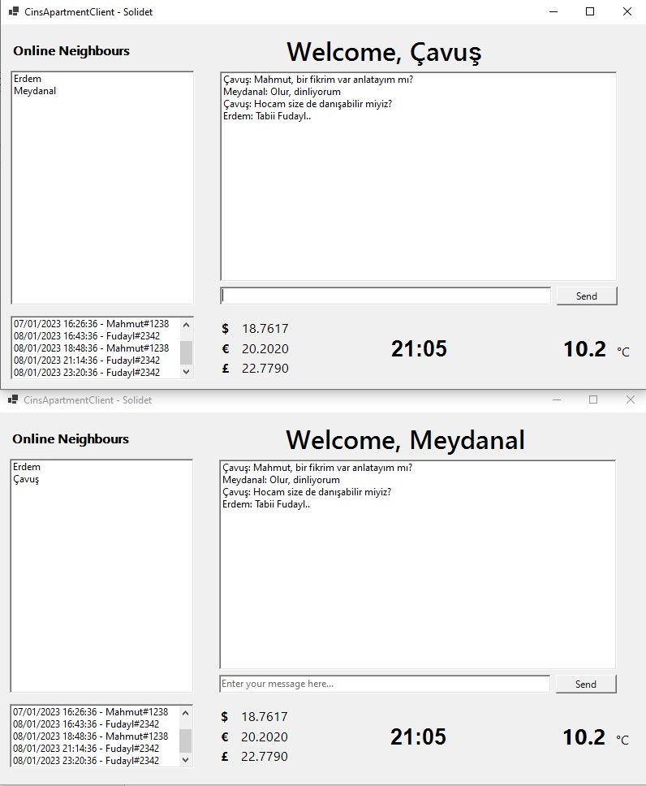

# Apartment-Management-Sys

> Developers: [*Fudayl Çavuş*](https://www.linkedin.com/in/fudaylcavus/) | [*Mahmut Sacit Meydanal*](https://www.linkedin.com/in/mahmut-sacit-meydanal-110271231/) 

Detailed explanation and Technical Report can be found [here](./M.S.%20Meydanal,%20F.%20I.%20Cavus,%20CinsApartmentManagement_Report_FM.pdf)

### Used
 * Sockets
 * Threads
 * Windows Forms

_No external libraries are used_

### Implemented & Created

* Completely Async Server
* Client-Server Architecture
* Pre-caching method for continous data-transfer
* Library-like [Client Model](./SolidCinsAppServer/SolidCinsAppServer/Models/Client.cs)
* Generic Packet Serializer for data-transfer
* Clean Code Base

### Features

#### Client
* can see current online users
* can see current exchange ratios (server-side data)
* can see current weather temperature (server-side data)
* can see outer-gate log
* can send message to all neighbours
* is protected via server-side credential control
* has familiar UI

#### Server
* can handle multiple clients at a time
* can handle the change of user status and broadcast
* can consume APIs asynchronously

### Preview

